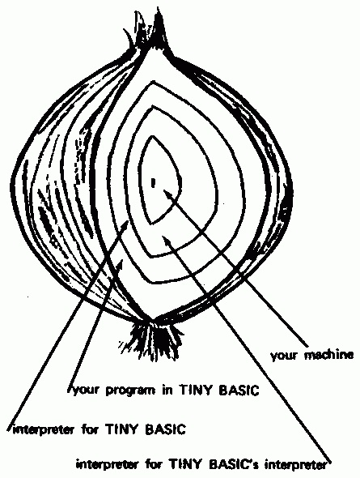

# TINY BASIC VIRTUAL MACHINE
This repository contains all the elements needed to replicate the original Tiny Basic Interpreter Virtual Machine as described in by Dennis Allison

[People's Computer Company Vol. 4, No. 2](http://www.ittybittycomputers.com/IttyBitty/TinyBasic/DDJ1/Design.html)  


# ILM_ASSEMBLER
A two steps assembler to build the machine code.

It take as input the "intp.asm" file and build the binary file "intp.o".

The "intp.asm" file is a lighlty modified version of the original IL code (available as "intp_original.asm").  

```
--- intp.asm    
+++ intp_original.asm   
@@ -59,7 +59,6 @@
             RSTR                  ;RESTORE LINE NUMBER OF CALL
             NXT                   ;SEQUENCE TO NEXT STATEMENT
     S13:    TST     S14,'END'
-            MODE    0             ;(MY ADD : SET IMMEDIATE MODE)
             FIN
     S14:    TST     S15,'LIST'    ;LIST COMMAND
             DONE
@@ -67,13 +66,10 @@
             NXT
     S15:    TST     S16,'RUN'     ;RUN COMMAND
             DONE
-            MODE    1             ;(MY ADD : SET RUN MODE)
             NXT
-    S16:    TST     S_16,'CLEAR'   ;CLEAR COMMAND
+    S16:    TST     S17,'CLEAR'   ;CLEAR COMMAND
             DONE
             JMP     START
-    S_16:   TST     S17,'EXIT'    ;(MY ADD : TERMINATE VIRTUAL MACHINE)
-            MODE    2             ;(MY ADD)

     S17:    ERR                   ;SYNTAX ERROR

```  
The added DONE instruction (0x22) read the following byte and set the Virtual machine mode.

Availabale modes :
```  
0 = direct  
1 = run  
2 = exit  
```  

# ILM
The virtual machine running the binary interpreter.

It take as input the "intp.o" file and execute the interpreter.  


# Compile
On windows you can use the included "*.bat" files to build the projects with MSVC or MINGW.  


# Example program  

Print the first 10 numbers of fibonacci serie  

``` 
10 LET I = 0
20 LET X = 1
30 LET Y = 0  
40 PRINT "FIB ", I," : ", X  
50 LET Z = X  
60 LET X = X + Y  
70 LET Y = Z  
80 LET I = I + 1  
90 IF I <= 10 THEN GOTO 40  
100 END   
``` 
Output :  
```
FIB  0  :  1
FIB  1  :  1
FIB  2  :  2
FIB  3  :  3
FIB  4  :  5
FIB  5  :  8
FIB  6  :  13
FIB  7  :  21
FIB  8  :  34
FIB  9  :  55
FIB  10  :  89
```

# Language summary

```
INPUT varlist  
LET var = expr  
PRINT exprlist  
GOTO expr 
IF expr (=,>,<,>=,<=,<>) expr THEN statement  
GOSUB expr  
RETURN  
END  
RUN  
LIST  
CLEAR
EXIT ( to terminate the virtual machine )
```
# Language grammar
```
line::= number statement   | statement 
statement::=  	PRINT expr-list
	IF expression relop expression THEN statement
	GOTO expression
	INPUT var-list
	LET var = expression
	GOSUB expression
	RETURN
	CLEAR
	LIST
	RUN
	END
expr-list::= (string | expression) (, (string | expression) )*
var-list::= var (, var)*
expression::= (+ | - | e) term ((+ | -) term)*
term::= factor ((* | /) factor)*
factor::= var | number | (expression)
var::= A | B | C ..., | Y | Z
number::= digit digit*
digit::= 0 | 1 | 2  | ...  | 8 | 9
relop::= < (> | = | e) | > (< | = | e) | = 

```